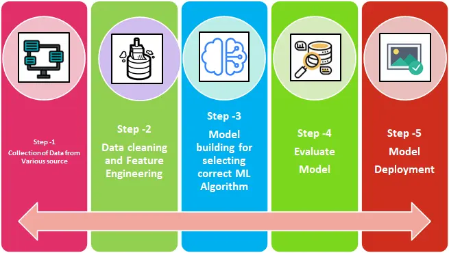

# Script

Este guia hands-on é um convite para desenvolvedores que desejam treinar seu primeiro modelo de Machine Learning e entender, de forma prática, como funciona o processo de construção de uma solução de Inteligência Artificial.

O objetivo é manter o conteúdo simples, prático e acessível, sem entrar profundamente em detalhes teóricos. Ao final, você terá treinado, avaliado e salvo um modelo de classificação de texto utilizando Python.

O dataset utilizado neste tutorial foi criado por Mauricio Seiji e é composto por artigos de notícias em português do Brasil.

## Golden Rules

- Start with simple models and adding complexity only when justify.
- Rigorously evaluate the model output through manual review and appropriate metrics before deploying.

## IA Generativa vs. IA Preditiva

De forma geral, soluções de Inteligência Artificial podem ser classificadas em dois grandes grupos:

* **IA Generativa** – Modelos como o ChatGPT. Você não treina o modelo; apenas escreve prompts e consome uma API fornecida por um provedor de LLM.
* **IA Preditiva (Machine Learning)** – Modelos treinados a partir dos seus próprios dados. Este tutorial tem foco nesse tipo de abordagem.

Treinar um modelo próprio envolve diversas etapas conceituais e práticas. Essas etapas são **iterativas**, ou seja, você pode avançar ou retornar conforme refina os resultados.

## Ciclo de Vida de um Modelo de Machine Learning

Um fluxo típico de Machine Learning inclui cinco etapas principais:

1. **Coleta de dados**
2. **Limpeza dos dados e engenharia de atributos**
3. **Treinamento do modelo**
4. **Avaliação do modelo**
5. **Deploy do modelo**

A ideia central: **você sempre pode voltar etapas para melhorar o modelo**.

Este tutorial percorre cada uma dessas etapas de forma prática. 

Tudo isso pod ser feito rodando tudo no **Google Colab**.

## Passo 1 – Obtenção dos Dados

O dataset utilizado é o **News Articles pt-BR**, que possui as seguintes características:

* 500 artigos de notícias em português do Brasil
* 5 categorias:

  * Ciência e Tecnologia
  * Economia
  * Entretenimento
  * Política
  * Esportes

Cada artigo pertence a **uma única categoria**.

Após o carregamento, o conjunto de dados contém duas colunas:

* `text`: conteúdo bruto do artigo
* `label`: categoria do artigo

---

## 🧹 Passo 2 — Limpeza dos dados (pré-processamento) and Feature Enginnering

## Análise Exploratória dos Dados (EDA)

São realizadas duas análises exploratórias principais:

### 1. Distribuição das Categorias

Um gráfico de barras mostra que as categorias estão **balanceadas**, o que ajuda a evitar viés no treinamento do modelo.

### 2. Palavras Mais Frequentes

Um gráfico com as 20 palavras mais frequentes ajuda a identificar ruídos restantes. Por exemplo, letras isoladas como `"r"` podem ser adicionadas às stopwords.

A EDA auxilia na tomada de decisões sobre melhorias na limpeza e na modelagem.

Antes do treinamento, os dados de texto precisam ser limpos e padronizados.

As etapas de pré-processamento incluem:

* Conversão do texto para letras minúsculas
* Tokenização
* Remoção de:

  * Stopwords
  * Números
  * Pontuação
  * Caracteres especiais

O texto tratado é armazenado em uma nova coluna chamada **`text_clean`**.

Essa etapa reduz ruídos e melhora significativamente a qualidade do modelo.

---

## Passo 4 – Avaliação do Modelo

O modelo é avaliado utilizando a métrica de **acurácia**.

* Acurácia obtida: **entre 85% e 90%**

Se esse valor é bom ou não depende do problema sendo resolvido. Em muitos cenários, busca-se uma acurácia acima de 90%, mas problemas mais complexos podem apresentar valores menores.

Possíveis melhorias incluem:

* Coletar mais dados
* Aprimorar o pré-processamento
* Testar outros algoritmos, como:

  * Support Vector Classifier (SVC)
  * Regressão Logística

---

## Passo 5 – Deploy do Modelo

O modelo treinado é salvo utilizando `pickle`, permitindo sua reutilização posterior, por exemplo em uma API REST.

Após carregado, o modelo é capaz de:

* Receber um novo texto
* Retornar a probabilidade de cada categoria

No exemplo apresentado, um texto relacionado a futebol é corretamente classificado como **Esportes**, com a maior probabilidade.

Model Inference: https://github.com/brick-so/thalamus-serve/tree/main

---

## Exercício Prático

1. Copie um texto de um portal de notícias de sua preferência
2. Execute a predição utilizando o modelo treinado
3. Verifique em qual categoria o modelo classifica o texto

Esse exercício ajuda a validar se o modelo está funcionando conforme o esperado.

---

## Conclusão

Este tutorial demonstrou o **processo completo** de treinamento de um modelo de Machine Learning:

* Coleta de dados
* Limpeza
* Treinamento
* Avaliação
* Deploy

Apesar de ser um exemplo simples, ele segue os mesmos princípios fundamentais utilizados em sistemas reais de IA, inclusive em modelos de larga escala.

Este é apenas o começo — o universo de Machine Learning oferece inúmeras técnicas, modelos e possibilidades para explorar.

---
